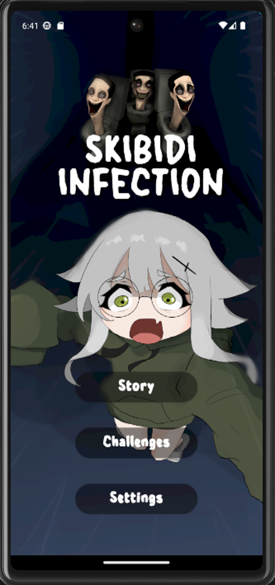
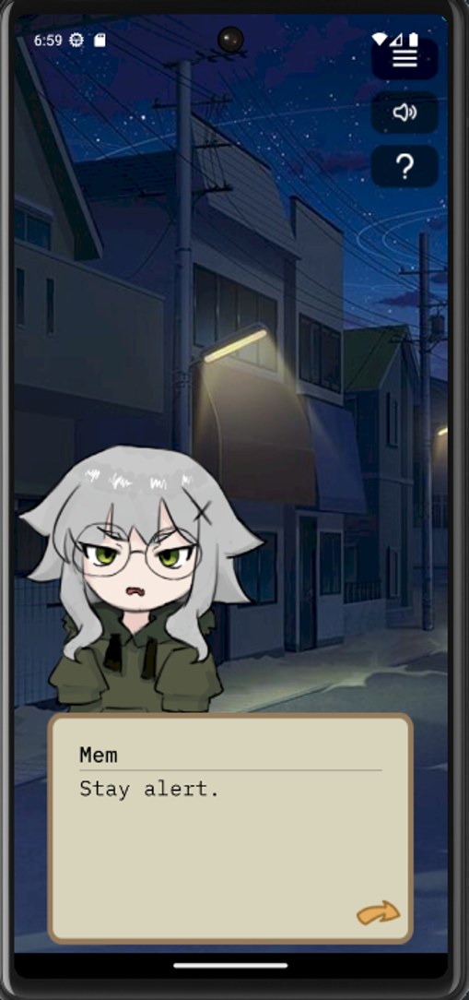
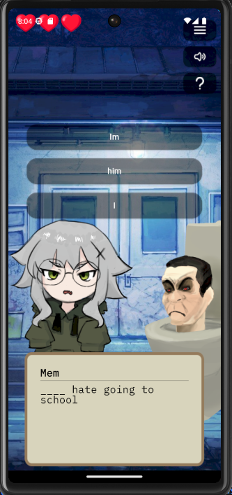
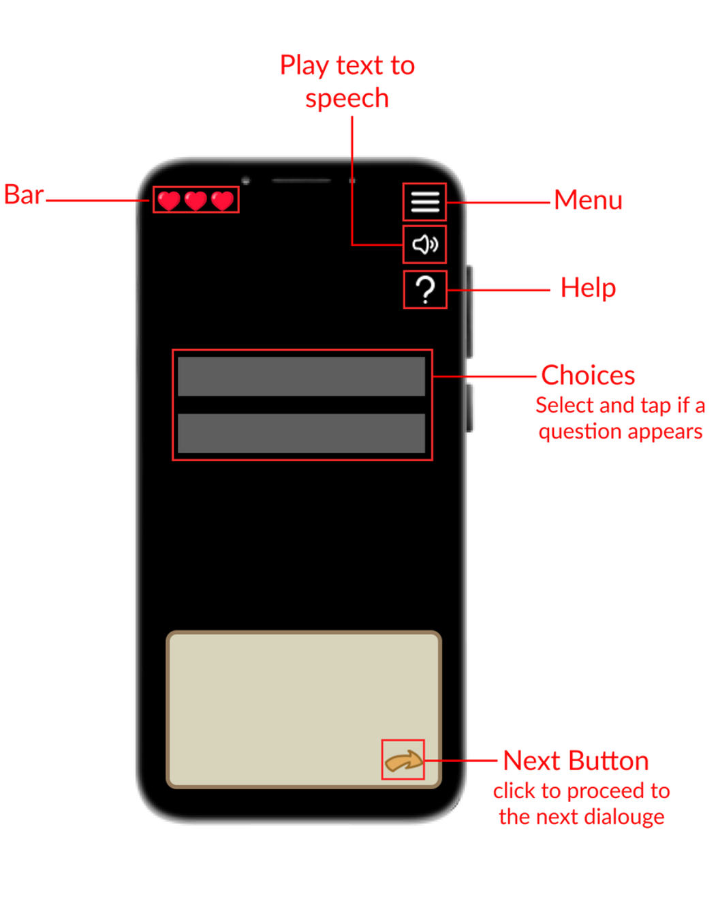

  

## Screenshots

    
    
    

## Controls

 

# Skibidi Invasion: A Visual Learning Novel Game

This visual novel learning game was created using flutter that would help users learn basic english grammar, science facts, and math eqations.

## About

The plan is to use dart as the main languange for the project.

## How to run

- Install Android Studio/Visual Studio Code
- Ensure that you had installed flutter sdk
- Ensure that you had installed dart
- Install any android emulator to your liking
- Run Skibidi Invasion

## Contributing 

Pull requests are welcome. For major changes, please open an issue first 
to discuss what you would like to change.
